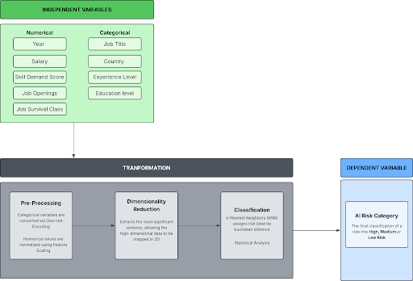

```{r, include=FALSE}
library(class)
library(dplyr)
library(ggplot2)
library(caret)
library(reshape2)
library(psych)
library(knitr)
```


# Abstract
As artificial intelligence (AI) continues to change the workplace, there is a growing concern about job loss and automation. This study aims to predict the Al risk levels of various global job roles to identify which are most vulnerable. The researchers used a dataset of 12,343 job records spanning from 2015 to 2035. A machine learning tool, the K-Nearest Neighbors (KNN) algorithm, was used to group these jobs into High, Medium, or Low Al-risk categories. This grouping was based on simple market factors like salary, skill demand, job openings, experience level, and education. The results showed that the computer model was highly successful, predicting the correct risk category with 86.84% accuracy. The findings revealed that "High Risk" jobs have unique features that make them easy to identify. On the other hand, "Low Risk" and "Medium Risk" jobs share many traits, meaning the line between safe and moderately threatened jobs is very thin. Ultimately, the study proves that Al disruption does not happen randomly, but follows clear patterns. Based on these patterns, workers in high-risk roles need to quickly learn new skills, while a small upgrade in skills can easily help workers in medium-risk jobs move to safer positions.

# Chapter 1

## Background of the Study
Artificial Intelligence has been growing substantially over the past few years, and it has been getting more capable for a lot of tasks in many professional areas. As organizations increasingly adopt Al-driven technologies, the concern about job displacement, automation risk, and shifting salary patterns has become a central topic in both academic research and workforce planning. The dataset captures these key variables across a projected time span of two decades. These datasets are made to reflect realistic relationships, for example, increasing AI adoption is often associated with higher productivity. The inclusion of future projections allows for predictive analysis, enabling researchers and students to explore possible scenarios in the evolving job market. This aligns with research efforts that aim to analyze how Al affects employment structures, wage distribution, and the demand for reskilling initiatives. This study utilizes the AI Job Risk and Salary Dataset (2015-2035) to investigate the relationship between AI adoption, job risk levels, and salary trends. The findings of this study aim to contribute to a deeper understanding of workforce transformation and to provide data-driven insights that can guide career planning in an Al-driven world.

## Statement of the Problem
The rapid integration of Al into various industries has transformed job structures and skill requirements. While AI creates new opportunities, it introduces a pressing need to accurately identify which roles face the highest risk of automation based on underlying labor market metrics. Specifically, it seeks to answer the following questions:

* What are the baseline characteristics of the dataset in terms of salary, skill demand scores, and job openings?
* How are global occupations distributed across the High, Medium, and Low AI Risk categories?
* How effectively can job roles be classified into distinct AI risk categories based on their numeric market factors?
* What is the predictive accuracy of the KNN algorithm in determining the automation risk of a given occupation?

## Objectives of the Study

### General Objective
* To predict and classify the artificial intelligence automation risk of global job roles using machine learning techniques.

### Specific Objectives
* To describe the distribution of salaries, skill demand scores, and job openings across different global job roles.
* To evaluate the accuracy and predictive performance of the classification model.

## Hypotheses
* **HO (Null Hypothesis):** The classification model cannot accurately predict the AI Risk Category of job roles based on salary, skill demand score, job openings, experience level, and education level at a rate better than random chance.
* **H1 (Alternative Hypothesis):** The classification model can accurately predict the AI Risk Category of job roles based on salary, skill demand score, job openings, experience level, and education level.

## Significance of the Study
The following groups can benefit from the results of this research:

**Students and Job Seekers.** Individuals entering the workforce stand to benefit from a data-driven understanding of highly demanded, future-proof skills. The insights from this study can serve as a strategic guide, allowing them to make informed decisions regarding their educational pursuits, skill acquisition, and long-term career trajectories in an evolving labor market.

**Professionals and Employees.** Current members of the workforce can utilize the findings to accurately assess the automation risks associated with their specific roles. By understanding their job's vulnerability to AI, professionals are empowered to proactively upskill or reskill, ensuring they remain relevant, adaptable, and competitive in a technology-driven work environment.

**Academic Institutions and Training Providers.** Educators, curriculum developers, and vocational trainers can utilize the findings to identify which technical skills are currently commanding high market demand and which roles are most susceptible to automation. This enables them to strategically adapt their curricula and advising programs, ensuring that learners are equipped with resilient competencies that align with actual industry needs.

**Employers and Human Resource Professionals.** Organizations and recruiters can leverage the study's insights into skill demand and Al risk to forecast future workforce needs. This allows them to optimize talent acquisition strategies, design effective corporate training and reskilling programs, and better manage the organizational transition toward Al-integrated operations.

**Future Researchers.** This study contributes to the growing body of literature concerning the intersection of artificial intelligence, labor economics, and predictive career analytics. As such, it can serve as a foundational reference for future investigations involving broader global datasets, different economic sectors, or more advanced machine learning modeling techniques.

## Scope and Limitations
The study covers both historical and projected data from 2015 to 2035, aiming to identify patterns in how Al adoption influences employment opportunities, required skills, and compensation levels. The study primarily relies on quantitative data to generate insights, including relationships between job roles, emerging skills, and salary growth, as well as the potential risks of automation in different sectors. 

However, the study is subject to several limitations. It depends solely on the variables available in the dataset, which may not fully capture all real-world factors affecting employment, such as economic fluctuations, government policies, or cultural influences. The projected data extending to 2035 is based on predictive models and assumptions, meaning actual future outcomes may differ. The study, additionally, does not incorporate qualitative perspectives, such as individual experiences or company-specific strategies, which could provide a deeper context.

---

# Chapter 2

## Related Studies
Addressing the critical question of whether Al will replace tech workers, the chosen dataset blends qualitative insights from Hananto et al. (2025) with quantitative data from the Future of Jobs AI Dataset (2015-2035) to show that Al is redefining roles rather than eliminating them. Hananto et al. highlight that while generative tools like GitHub Copilot automate routine tasks slashing task times by over 55% and threatening entry-level positions-they simultaneously elevate expectations by driving demand for advanced skills in system design and Al integration. This qualitative shift aligns with the quantitative metrics of the 12,343-record dataset, which reveals that while technical roles like AI Researchers and ML Engineers enjoy high survival classifications and low risk scores (0.15), analytical roles like Business Analysts face the highest risk (0.75). Crucially, because skill demand scores remain high and stable (around 79/100) across all 10 tracked occupations, the data collectively prove that Al acts as a catalyst for heightened job complexity and higher human competencies rather than widespread displacement.

## Related Literature
The tech economy can be regarded as a knowledge-based economy where human resources are valued as assets in both creative and technological domains. Thus, human resources are deemed as invaluable asset capital. According to Wuttahapan (2017), Human Capital Theory explains this phenomenon through an economic lens, asserting that investments in human capital-such as education, training, and accumulated experience-yield competitive advantage and sustainability for both individuals and organizations in a complex business world. As of now, human capital still remains the primary driver of organizational success, but the advancement of Artificial Intelligence introduces a new dynamic: the risk of technological automation or displacement. The valuation of human capital is no longer static; it is highly susceptible to technological disruption. As AI models become increasingly proficient in human tasks that require cognitive skills (such as basic programming, data analysis, or technical writing), the "AI Risk" associated with specific tech roles fluctuates. One's vulnerability to Al displacement is intrinsically tied to one's specific human capital profile. For example, jobs that are heavily reliant on routine coding tasks may exhibit higher Al risk compared to jobs requiring complex, strategic decision-making.

K-Nearest Neighbor (KNN) is a supervised machine learning model, mainly used for classification. This model learns by finding the k objects in the training set closest to the test object and bases the label assignment on the class in this neighborhood (Steinbach & Tan, 2009). Because it operates on the principle of feature similarity rather than assuming strict underlying data distribution, KNN is highly effective at mapping non-linear relationships in real-world data. This localized, proximity-based logic provides a strong theoretical foundation for analyzing social phenomena, such as the vulnerability of certain job positions to artificial intelligence. The algorithm serves as an ideal mechanism for this study to evaluate how clustered socioeconomic profiles significantly correlate with varying degrees of Al risk.

---

# Chapter 3

## Research Design
This study employs a quantitative, descriptive-predictive research design. The descriptive component involves the summarization and characterization of the "Future of Jobs AI Dataset," detailing the distribution of global labor market attributes such as financial compensation, job availability, and primary skill demand scores. The predictive component utilizes a supervised machine learning classification approach. Specifically, a k-Nearest Neighbors (kNN) algorithm is applied to develop a model capable of predicting the categorical artificial intelligence risk level of an occupation (Low Risk, Medium Risk, or High Risk) based on its underlying numerical market variables.

## Data Collection
This research utilizes secondary data sourced from Kaggle, a public repository for data science assets. The analysis is based exclusively on the "Future of Jobs AI Dataset", which compiles comprehensive global employment metrics. In total, the dataset consists of 12,343 individual job entries characterized by 13 distinct variables related to career attributes, financial compensation, and automation vulnerability. 

Since this study relies entirely on an existing dataset, no primary data gathering procedures, such as surveys or interviews, were necessary. Upon acquiring the comma-separated values (CSV) file, an initial data integrity check was conducted, confirming the absence of any missing or null values. To optimize the data for the KNN classification algorithm, specific preprocessing steps were taken. Highly descriptive categorical columns, namely salary_bucket and primary_skill, were removed from the dataset. Furthermore, the continuous numerical ai_risk_score was excluded to prevent data leakage, ensuring the algorithm predicts the final categorical risk level based on remaining market factors rather than direct risk calculations. The remaining qualitative attributes, such as Job Title and Country, were dynamically transformed into numerical features via one-hot encoding within the predictive feature matrix alongside numerical variables like Year, allowing the kNN model to compute distances across both structural and macroeconomic factors.

## Variables Description
To understand how artificial intelligence might affect different jobs, this study focuses on specific variables from the dataset. We selected three main job characteristics to help predict a job's overall risk of being automated.

### Dependent Variable
**AI Risk Category:** This is the main outcome we are trying to predict. Every job in the given dataset is grouped into one of three levels: Low Risk, Medium Risk, or High Risk. The goal of our computer model is to correctly guess which category a job belongs to based on its market factors.

### Independent Variables
We used the following three numeric factors to see if they can accurately predict a job's AI risk level:

* **Numeric Market Factors:** Variables such as Salary, Skill Demand Score, and Job Openings were used to measure the financial compensation and overall market demand for the role.
* **Professional Characteristics:** Variables such as Experience Level and Education Level were included to test if higher academic requirements or seniority serve as protective barriers against automation.

### Excluded Variables
To ensure the validity of the study and prevent data leakage (where the algorithm inadvertently receives the "answer" before it learns), three specific variables were deliberately removed from the analysis:

* **AI Risk Score:** Removed because it is a direct numerical translation of the target outcome.
* **Salary Bucket:** Removed because it is repetitive information already covered by the specific Salary variable.
* **Primary Skill:** Excluded to streamline the model and prevent the algorithm from becoming overly focused on text-heavy descriptions.

## Data Analysis Techniques

### Descriptive Statistics and Feature Engineering
Descriptive statistics will be utilized to summarize the baseline characteristics of the scaled dataset prior to modeling. For the continuous predictor variables, measures of central tendency (mean and median) and dispersion (standard deviation and range) will be calculated to understand the data's underlying distribution. To prepare the dataset for algorithmic processing, critical feature engineering steps will be implemented. First, one-hot encoding will be applied to convert all categorical text variables into a numeric binary matrix. Subsequently, Z-score standardization (scaling) will be implemented across all predictor variables. This scaling ensures that features with inherently larger ranges, such as Salary or Job Openings, do not disproportionately dominate the algorithm's distance calculations.

Furthermore, because the market features are multi-dimensional, the researchers utilize Principal Component Analysis (PCA) for dimensionality reduction. This allows the high-dimensional, scaled feature space to be projected into two-dimensional visual clusters, enabling the identification of inherent structures and class overlap prior to classification.

### Machine Learning (K-Nearest Neighbors Classification)
To predict an occupation's vulnerability to automation, a supervised K-Nearest Neighbors (KNN) classification model will be deployed, designating ai_risk_category as the target dependent variable. The scaled dataset will be partitioned into two subsets: an 80% training set used to formulate the model's pattern recognition, and a 20% testing set reserved strictly for out-of-sample validation. The algorithmic hyperparameter for the optimal number of k-neighbors will be dynamically assigned based on the square root of the training dataset's size ($k=\sqrt{n}$).

### Model Validation and Performance Metrics
The model's predictive validity will be evaluated using a multiclass confusion matrix. Moreover, the overall classification accuracy percentage and performance will be decomposed into class-specific metrics:

* **Sensitivity (Recall):** To measure the model's ability to identify all true instances of a risk category (critical for identifying "High Risk" roles).
* **Precision (Positive Predictive Value):** To determine the reliability of a risk designation.
* **F1-Score:** To provide a harmonic mean of precision and sensitivity, offering a balanced view of model performance across the unevenly distributed risk categories.
* **Cohen's Kappa:** To assess the agreement between predicted and actual categories while accounting for the possibility of agreement occurring by chance.

## Conceptual Framework


---

# Chapter 4

## Results and Discussions

```{r, include=FALSE}
data <- read.csv("dataset.csv")

data_clean <- data %>%
  select(-salary_bucket, -ai_risk_score, -primary_skill) %>%
  na.omit()

data_clean$ai_risk_category <- as.factor(data_clean$ai_risk_category)

predictors <- model.matrix(~ . - ai_risk_category - 1, data = data_clean)
target <- data_clean$ai_risk_category

predictors_scaled <- scale(predictors)

pca_scaled <- prcomp(predictors_scaled)
scaled_df <- data.frame(
  PC1 = pca_scaled$x[, 1],
  PC2 = pca_scaled$x[, 2],
  Class = target
)
```

## Descriptive Statistics
After the pre-processing stage, the final dataset utilized for analysis consists of 12,343 complete observations $(N=12,343)$ with zero missing values. This dataset comprises five continuous numerical predictors and four structured categorical attributes.

| Variable | n | mean | sd | median | min | max |
| :--- | :--- | :--- | :--- | :--- | :--- | :--- |
| Year | 12343 | 2025.05 | 6.06 | 2025.00 | 2015.00 | 2035.0 |
| Salary | 12343 | 34553.73 | 18024.70 | 31573.38 | 3875.17 | 113589.3 |
| Skill Demand Score | 12343 | 79.45 | 11.48 | 79.00 | 60.00 | 99.0 |
| Job Openings | 12343 | 25223.65 | 14163.31 | 24896.00 | 1002.00 | 49998.0 |
| Job Survival Class | 12343 | 1.31 | 0.66 | 1.00 | 0.00 | 2.0 |
\begin{center}
\emph{\small Table 1a. Descriptive Statistics for Numerical Variables (Summary \& Range)}
\end{center}


| Variable | trimmed | mad | range | skew | kurtosis | se |
| :--- | :--- | :--- | :--- | :--- | :--- | :--- |
| Year | 2025.06 | 7.41 | 20.0 | 0.00 | -1.21 | 0.05 |
| Salary | 33055.31 | 17317.81 | 109714.1 | 0.78 | 0.41 | 162.24 |
| Skill Demand Score | 79.44 | 14.83 | 39.0 | 0.01 | -1.19 | 0.10 |
| Job Openings | 25144.50 | 18108.48 | 48996.0 | 0.04 | -1.19 | 127.48 |
| Job Survival Class | 1.39 | 1.48 | 2.0 | -0.43 | -0.75 | 0.01 |
\begin{center}
\emph{\small Table 1b. Descriptive Statistics for Numerical Variables (Variance \& Shape)}
\end{center}

The descriptive statistics of the five numerical predictors, as shown in Table 1, reveal distinct structural patterns within the dataset. The chronological variable year spans from 2015 to 2035 with a mean of 2,025.05 and a median of 2,025.00 (skewness $= -0.00$), suggesting a perfectly temporal distribution. Annual salary exhibited a mean of USD 34,554.73 and a median of USD 31,573.38. This variance indicates a right-skewed distribution, supported by a positive skew value of 0.78 and a 0.41 kurtosis value. This suggests that a subset of specialized technical roles commands higher compensation than the broader workforce baseline. 

The market metrics skill demand score (mean $= 79.45$, median $79.00$, skewness $= 0.01$) and job_openings (mean $= 25,223.65$, median $= 24,896.00$, skewness $= 0.04$) both demonstrated symmetric, approximately uniform distributions. Finally, the ordinal stability metric job_survival_class yields a mean of 1.31 and a median of 1.00 with a slight left-skewness of -0.43. The immense discrepancies in baseline scales—ranging from single digits to tens of thousands empirically validate the necessity of the feature standardization step applied prior to model execution.


| Category | Count | Percentage |
| :--- | :--- | :--- |
| AI Researcher | 1209 | 9.8% |
| Business Analyst | 1312 | 10.63% |
| Cloud Engineer | 1273 | 10.31% |
| Cybersecurity Analyst | 1209 | 9.8% |
| Data Analyst | 1293 | 10.48% |
| Data Scientist | 1225 | 9.92% |
| DevOps Engineer | 1118 | 9.06% |
| ML Engineer | 1205 | 9.76% |
| Product Manager | 1247 | 10.1% |
| Software Engineer | 1252 | 10.14% |
\begin{center}
\emph{\small Table 2. Descriptive Statistics for the Distribution of Job Titles}
\end{center}


| Category | Count | Percentage |
| :--- | :--- | :--- |
| Australia | 2080 | 16.85% |
| Canada | 2021 | 16.37% |
| Germany | 2044 | 16.56% |
| India | 1989 | 16.11% |
| UK | 2145 | 17.38% |
| USA | 2064 | 16.72% |
\begin{center}
\emph{\small Table 3. Descriptive Statistics for the Distribution of Countries}
\end{center}


| Category | Count | Percentage |
| :--- | :--- | :--- |
| Entry | 4075 | 33.01% |
| Mid | 4073 | 33% |
| Senior | 4195 | 33.99% |
\begin{center}
\emph{\small Table 4. Descriptive Statistics for the Distribution of Experience Levels}
\end{center}


| Category | Count | Percentage |
| :--- | :--- | :--- |
| Bachelor | 4093 | 33.16% |
| Master | 4146 | 33.59% |
| PhD | 4104 | 33.25% |
\begin{center}
\emph{\small Table 5. Descriptive Statistics for the Distribution of Education Levels}
\end{center}


Tables 2 to 5 show the distribution of the categorical variables included in the dataset. For job titles, the entries are relatively balanced across occupations, with Business Analyst having the highest count at 1,312, followed by Data Analyst at 1,293 and Cloud Engineer at 1,273. This suggests that the dataset includes a fairly even representation of different technology-related job roles. In terms of country, the dataset is also fairly distributed across the six countries. The UK has the highest number of entries with 2,145, followed by Australia with 2,080, the USA with 2,064, Germany with 2,044, Canada with 2,021, and India with 1,989. This shows that the dataset offers a broad international perspective on employment trends related to Al risk. 

For experience level, the distribution is almost equal among Entry, Mid, and Senior levels. Senior-level roles have the highest count with 4,195 entries, followed by Entry-level roles with 4,075 and Mid-level roles with 4,073. Education level is also evenly distributed, with Master's degree holders having the highest count at 4,146, followed by PhD holders at 4,104, and Bachelor's degree holders at 4,093.

```{r, echo=FALSE, fig.width=5, fig.height=5, fig.cap="Distribution of AI Risk Categories", fig.pos="H"}
ggplot(data, aes(x = ai_risk_category, fill = ai_risk_category)) +
  geom_bar() +
  geom_text(stat = "count", aes(label = after_stat(count)), vjust = -0.5) +
  scale_fill_manual(values = c(
    "High Risk" = "#e41a1c",
    "Medium Risk" = "#377eb8",
    "Low Risk" = "#4daf4a"
  )) +
  labs(
    title = "Distribution of Occupations by AI Risk Category",
    x = "AI Risk Category",
    y = "Job Count",
    fill = "Risk Category"
  ) +
  theme_minimal()
```

Figure 1 shows the dependent variable, ai_risk_category. It outlines the baseline class proportions distribution within the dataset. As shown in the data, it is evident that the majority of the occupations were classified as in Medium Risk, accounting for 48.74% $(n=6,016)$ of the total observations. It is then followed by Low Risk, accounting for 32.67% $(n=4,033)$ of the sample, while occupations under High Risk comprised the remaining 18.59% $(n=2,294)$. This distribution represents the actual, real-world breakdown of the dataset before any predictions are made.


## Results

```{r, include=FALSE}
set.seed(15)

train_index <- sample(1:nrow(predictors_scaled), 0.8 * nrow(predictors_scaled))

train_x <- predictors_scaled[train_index, ]
test_x  <- predictors_scaled[-train_index, ]
train_y <- target[train_index]
test_y  <- target[-train_index]

k_value <- round(sqrt(nrow(train_x)))
if (k_value %% 2 == 0) k_value <- k_value + 1

knn_predictions <- knn(train_x, test_x, train_y, k_value)
cM <- confusionMatrix(knn_predictions, test_y, mode = "everything")
```

```{r, echo=FALSE}
overall_metrics <- data.frame(
  Metric = c(
    "Accuracy",
    "95% CI Lower",
    "95% CI Upper",
    "No Information Rate",
    "P-Value",
    "Kappa"
  ),
  Value = c(
    0.8684,
    0.8544,
    0.8815,
    0.4937,
    "< 2.2e-16",
    0.7914
  )
)

knitr::kable(
  overall_metrics,
  align = "c",
  row.names = FALSE
)
```
\begin{center}
\emph{\small Table 6. Overall Performance Metrics of the kNN Model}
\end{center}

```{r, echo=FALSE}
knitr::kable(
  data.frame(
    Class = c("Class: High Risk", "Class: Low Risk", "Class: Medium Risk"),
    Sensitivity = c(1.0000, 0.8529, 0.8269),
    Specificity = c(0.9664, 0.9150, 0.9088),
    Precision = c(0.8764, 0.7624, 0.8984),
    Recall = c(1.0000, 0.8529, 0.8269),
    F1 = c(0.9341, 0.8367, 0.8612),
    `Balanced Accuracy` = c(0.9832, 0.8839, 0.8679)
  ),
  align = "c",
  row.names = FALSE
)
```
\begin{center}
\emph{\small Table 7. Class-Specific Performance Metrics of the kNN Model}
\end{center}

The KNN model was evaluated using accuracy, Kappa, sensitivity, specificity, precision, recall, and F1 score (Table 4). Accuracy was used to determine the overall percentage of correctly classified observations, while Kappa measured the agreement between the actual and predicted categories beyond random chance. Sensitivity and recall were used to evaluate how well the model detected each AI Risk Category, while precision measured how reliable the model's predictions were for each category.

```{r, echo=FALSE, fig.pos="H"}
cm_df <- as.data.frame(cM$table)

# Force both axes to have the exact same factor levels and order
level_order <- c("High Risk", "Medium Risk", "Low Risk")
cm_df$Reference <- factor(cm_df$Reference, levels = level_order)
cm_df$Prediction <- factor(cm_df$Prediction, levels = level_order)

ggplot(cm_df, aes(x = Reference, y = Prediction, fill = Freq)) +
  geom_tile() +
  geom_text(aes(label = Freq), color = "white", size = 6) +
  scale_fill_gradient(low = "#fee0d2", high = "#de2d26") +
  theme_minimal()
```
\begin{center}
\emph{\small Figure 2. Confusion Matrix Heatmap}
\end{center}

Figure 2 shows the comparison between the actual AI Risk Categories and the predicted categories produced by the k-Nearest Neighbors model. The columns represent the actual risk categories, while the rows represent the predicted risk categories. The darker red cells indicate higher frequencies. Correct predictions are found along the diagonal of the matrix, while the off-diagonal cells represent the misclassifications.

```{r, echo=FALSE, fig.align="center", fig.pos="H"}
full_predictions <- knn(
  train = train_x,
  test = predictors_scaled,
  cl = train_y,
  k = k_value
)

knn_df <- data.frame(
  PC1 = pca_scaled$x[, 1],
  PC2 = pca_scaled$x[, 2],
  Predicted = full_predictions
)

ggplot(knn_df, aes(x = PC1, y = PC2, color = Predicted)) +
  geom_point(alpha = 0.7) +
  scale_color_manual(values = c(
    "High Risk" = "#e41a1c",
    "Medium Risk" = "#377eb8",
    "Low Risk" = "#4daf4a"
  )) +
  labs(
    title = "kNN Classification of Predicted AI Risk Categories",
    x = "PC1",
    y = "PC2",
    color = "Predicted Category"
  ) +
  theme_minimal()
```
\begin{center}
\emph{\small Figure 3. kNN Classification Plot}
\end{center}

Figure 3 shows the predicted AI Risk Categories generated by the kNN model for visualization. Each point represents a job entry, while the colors indicate the model's predicted category: High Risk, Low Risk, or Medium Risk.


## Discussions and Interpretation

The k-Nearest Neighbors (kNN) classification plot visually demonstrates how the model maps the predicted Al Risk Categories across the multi-dimensional feature space. The spatial graph indicates that Low Risk and Medium Risk jobs overlap in several major regions, suggesting that these two categories share highly similar underlying data characteristics, making them naturally more difficult for the distance-based algorithm to cleanly separate. Conversely, High Risk jobs appear spatially distinct and well-isolated, which directly supports the model's capacity to identify highly vulnerable positions with minimal ambiguity. 

This visual layout is strongly confirmed by the model's confusion matrix heatmap. While the confusion matrix demonstrates an outstanding overall classification performance, it exposes this precise mutual misclassification boundary between the Low and Medium Risk categories. The blurring of this boundary accounts for the primary source of error in the classification pipeline. On the other hand, the model's highly precise identification of High Risk categories implies that jobs heavily vulnerable to technological disruption possess unique, non-redundant traits that prevent them from blending into lower-risk brackets.

Quantitatively, the model achieved an overall predictive accuracy of 86.84%, proving that the KNN classifier successfully mapped the vast majority of the AI Risk Categories within the independent test dataset. Cohen's Kappa value of 0.7914 signifies a strong, statistically significant agreement between the actual ground-truth labels and the model's predictions well beyond baseline chance. Furthermore, because the overall accuracy drastically exceeded the No-Information Rate of 49.37%, the classifier proved to be substantially more powerful than a naïve guess favoring the majority class.


# Chapter 5

## Conclusion and Recommendations

## Conclusion

The study successfully developed and evaluated a k-Nearest Neighbors (kNN) classification model to predict the artificial intelligence automation risk of global job roles. By analyzing key demographic and market variables namely salary, skill demand scores, job openings, experience level, and education level. The model demonstrated a highly robust predictive capability. Achieving an overall classification accuracy of 86.84% and a Cohen's Kappa of 0.7914, the algorithm's performance substantially exceeded the No-Information Rate (49.37%). Consequently, the study rejects the null hypothesis and confirms the alternative hypothesis: a machine learning classification model can accurately and reliably predict the AI Risk Category of job roles based on numeric market factors.

A critical analytical finding derived from the spatial classification plot and confusion matrix is the distinct, isolated nature of High Risk occupations. The data proves that roles highly vulnerable to AI displacement possess unique, non-redundant market traits, allowing the algorithm to identify them with precision. In contrast, Low Risk and Medium Risk roles exhibit significant feature overlap, indicating that the economic and structural boundaries between safe and moderately threatened jobs are highly similar. Ultimately, the study concludes that AI disruption is not random; it follows identifiable macroeconomic and skill-based patterns that can be mathematically mapped, proving that technology is systematically redefining job complexities rather than unpredictably eliminating them.

## Recommendations

Based on the quantitative findings and conclusions of this study, the following recommendations are proposed for various stakeholders:

**For Students, Job Seekers, and Current Professionals**: Individuals must leverage these predictive insights for strategic career planning. Because High Risk roles possess distinct, easily identifiable characteristics, workers currently occupying or pursuing these positions should urgently prioritize upskilling. Furthermore, the significant data overlap between Low and Medium Risk categories suggests that even minor, incremental skill adjustments, particularly focusing on complex system design or AI integration as noted in the literature, can effectively shift a professional's profile into a safer, future-proof automation bracket.

**For Academic Institutions and Training Providers**: Educational entities should integrate predictive labor analytics into their curriculum development cycles. By understanding the specific mathematical traits that isolate High Risk jobs, institutions can proactively phase out training programs focused on highly automatable routines. Syllabi should instead be aggressively realigned to foster the advanced, non-routine competencies characteristic of lower-risk technological roles.

**For Employers and Human Resource Professionals**: Organizations are encouraged to adopt machine learning frameworks, similar to the kNN model demonstrated in this study, for internal workforce planning and talent management. By identifying the exact data thresholds where roles transition into High Risk categories, HR departments can deploy targeted, preemptive reskilling initiatives for vulnerable employees, facilitating smooth organizational transitions toward AI integration rather than relying on reactive downsizing.

**For Future Researchers**: While the current kNN algorithm achieved high overall accuracy, future studies should investigate the overlapping feature space between the Low and Medium Risk categories in greater depth. Researchers are encouraged to incorporate additional qualitative or granular variables, such as specific software proficiencies, emotional intelligence requirements, or daily task repetitiveness, to further separate these entangled classes. Additionally, applying more complex ensemble machine learning techniques, such as Random Forests or Support Vector Machines (SVM), should be explored to determine if classification accuracy and class-specific precision can be optimized beyond the current 86.84% benchmark.


## References

Hananto, A., Hasibuan, N. S., Olivia, S., Tukino, T., & Novalia, E. (2025). The impact of artificial intelligence on programmer jobs: Threat or opportunity? *JUSIFO (Jurnal Sistem Informasi), 11*(1), 11–20. https://doi.org/10.19109/jusifo.v11i1.25082

Wuttaphan, N. (2017, October 20). Human capital theory: The theory of human resource development, implications, and future.

Steinbach, M., & Tan, P. (2009). kNN: k-Nearest Neighbors. In The Top Ten Algorithms in Data Mining (1st ed., pp. 165–176). https://doi.org/10.1201/9781420089653-15

## Appendices

### Appendix A: Code

```{r, eval=FALSE}
# Load Libraries

library(class)
library(dplyr)
library(ggplot2)
library(caret)
library(reshape2)
library(psych)
library(knitr)
```

```{r, eval=FALSE}
# Load Dataset

data <- read.csv("future_of_jobs_AI_dataset.csv")

str(data)
summary(data)
```

```{r, eval=FALSE}
# Data Cleaning

data_clean <- data %>%
  select(-salary_bucket, -ai_risk_score, -primary_skill) %>%
  na.omit()

data_clean$ai_risk_category <- as.factor(data_clean$ai_risk_category)
```

```{r, eval=FALSE}
# Feature Engineering

predictors <- model.matrix(~ . - ai_risk_category - 1, data = data_clean)
target <- data_clean$ai_risk_category

predictors_scaled <- scale(predictors)
```

```{r, eval=FALSE}
# Train-Test Split

set.seed(15)

train_index <- sample(1:nrow(predictors_scaled), 0.8 * nrow(predictors_scaled))

train_x <- predictors_scaled[train_index, ]
test_x  <- predictors_scaled[-train_index, ]

train_y <- target[train_index]
test_y  <- target[-train_index]
```

```{r, eval=FALSE}
# PCA Setup

pca_scaled <- prcomp(predictors_scaled)

pca_df <- data.frame(
  PC1 = pca_scaled$x[, 1],
  PC2 = pca_scaled$x[, 2],
  Class = target
)
```

```{r, eval=FALSE}
# kNN Model

k_value <- round(sqrt(nrow(train_x)))
if (k_value %% 2 == 0) k_value <- k_value + 1

knn_predictions <- knn(
  train = train_x,
  test = test_x,
  cl = train_y,
  k = k_value
)
```

```{r, eval=FALSE}
# Model Evaluation

cM <- confusionMatrix(knn_predictions, test_y, mode = "everything")
```

```{r, eval=FALSE}
# Full Prediction Dataset

full_predictions <- knn(
  train = train_x,
  test = predictors_scaled,
  cl = train_y,
  k = k_value
)

knn_df <- data.frame(
  PC1 = pca_scaled$x[, 1],
  PC2 = pca_scaled$x[, 2],
  Predicted = full_predictions
)
```

```{r, eval=FALSE}
# Visualization (PCA Plot)

ggplot(knn_df, aes(x = PC1, y = PC2, color = Predicted)) +
  geom_point(alpha = 0.7) +
  scale_color_manual(values = c(
    "High Risk" = "#e41a1c",
    "Medium Risk" = "#377eb8",
    "Low Risk" = "#4daf4a"
  )) +
  labs(
    title = "kNN Classification of Predicted AI Risk Categories",
    x = "PC1",
    y = "PC2",
    color = "Predicted Category"
  ) +
  theme_minimal()
```

### Appendix B: Dataset from Kaggle

https://www.kaggle.com/datasets/shree0910/ai-job-risk-and-salary-dataset-20152035